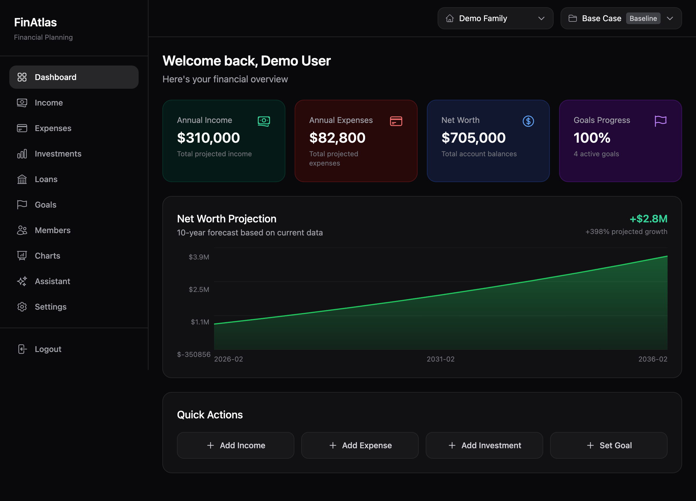
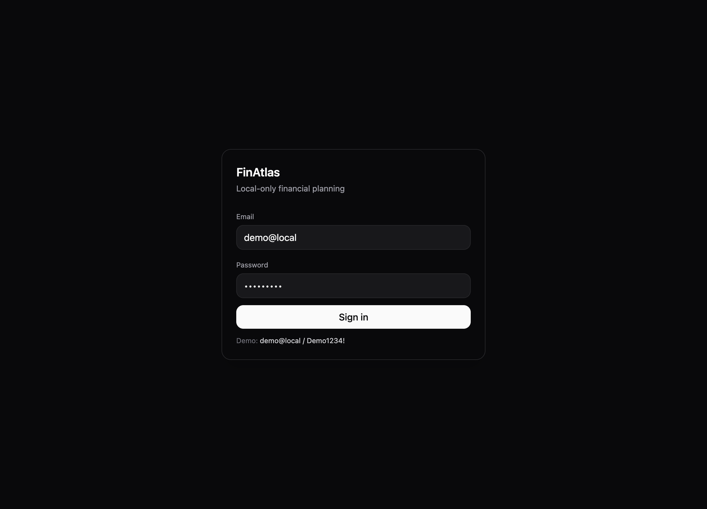
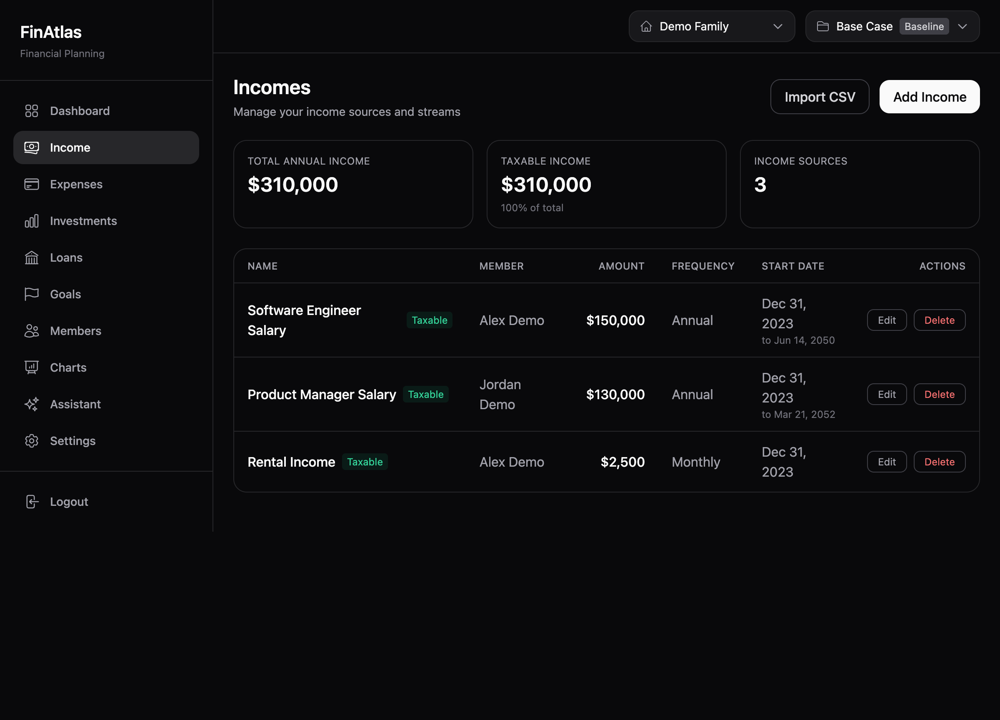
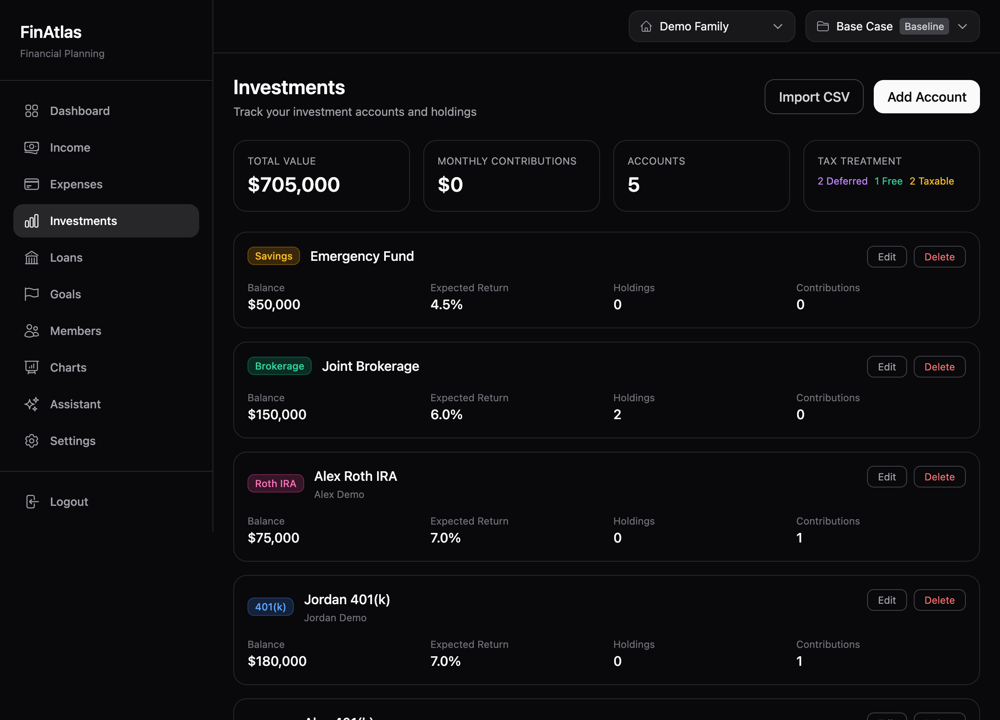
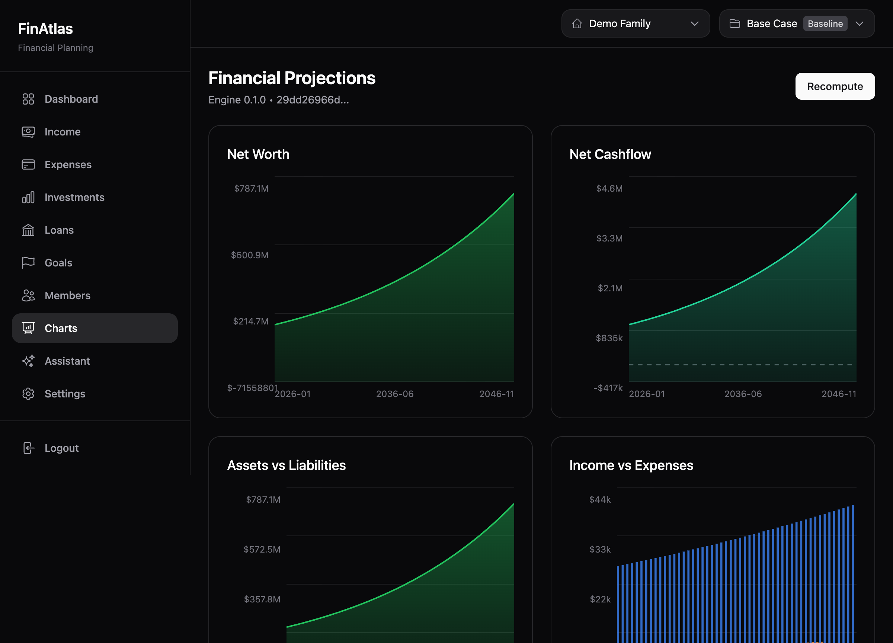
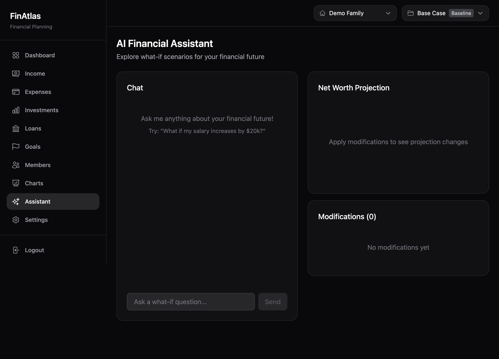

<p align="center">
  <h1 align="center">FinAtlas</h1>
  <p align="center">Comprehensive Personal Finance Management & Planning Platform</p>
</p>

<p align="center">
  
  
  
  
</p>

---

FinAtlas is a privacy-first, local-only household financial planning application that empowers individuals and families to take control of their financial future. With deterministic calculations, multi-scenario comparison, and an AI-powered assistant, FinAtlas provides institutional-grade financial planning tools in a clean, modern interface.



## Key Highlights

- **Privacy-First Architecture** — All data stored locally with SQLite. No financial data leaves your machine.
- **Deterministic Projections** — Every calculation is reproducible. No LLM approximations for your finances.
- **Multi-Scenario Planning** — Create baseline, optimistic, and pessimistic scenarios and compare them side-by-side.
- **AI-Powered Assistant** — Natural language interface for exploring what-if scenarios powered by Anthropic Claude.
- **47 Feature Pages** — Comprehensive coverage from daily budgeting to long-term retirement planning.
- **Multi-Household Support** — Manage separate financial profiles for different households or family structures.

---

## Screenshots

<table>
  <tr>
    <td align="center"><strong>Login</strong></td>
    <td align="center"><strong>Dashboard</strong></td>
  </tr>
  <tr>
    <td></td>
    <td></td>
  </tr>
  <tr>
    <td align="center"><strong>Income Management</strong></td>
    <td align="center"><strong>Investment Portfolio</strong></td>
  </tr>
  <tr>
    <td></td>
    <td></td>
  </tr>
  <tr>
    <td align="center"><strong>Financial Charts</strong></td>
    <td align="center"><strong>AI Assistant</strong></td>
  </tr>
  <tr>
    <td></td>
    <td></td>
  </tr>
</table>

---

## Feature Overview

### Money Flow
| Feature | Description |
|---------|-------------|
| **Income Tracking** | Track all income sources with flexible frequency options (monthly, biweekly, weekly, annual, one-time). Assign income to household members with growth projections. |
| **Expense Management** | Categorize and monitor expenses with customizable frequencies and inflation adjustments. |
| **Budget Tracking** | Set monthly budgets by category and monitor spending against defined targets. |
| **Spending Trends** | Analyze historical spending patterns over time with category-level breakdowns. |
| **Cash Flow Forecast** | Project monthly inflows, outflows, and running balance up to 24 months ahead. |

### Taxes & Investing
| Feature | Description |
|---------|-------------|
| **Tax Estimation** | Estimate federal and state tax liability with support for 2024 brackets, FICA, deductions, and filing status. |
| **Investment Accounts** | Manage 401(k), IRA, Roth IRA, Brokerage, and HSA accounts with individual holdings and contributions. |
| **Rebalancing** | Analyze portfolio allocation drift against targets and generate rebalancing recommendations. |
| **Investment Performance** | Track cost basis, gain/loss, and return percentages across all accounts with expandable holding detail views. |

### Debt Management
| Feature | Description |
|---------|-------------|
| **Loan Tracking** | Manage mortgages, auto loans, student loans, and personal debt with detailed terms and payment schedules. |
| **Amortization Schedules** | View month-by-month payment breakdowns showing principal vs. interest over the full loan term. |
| **Debt Payoff Strategies** | Compare snowball and avalanche payoff methods with projected timelines and total interest savings. |
| **Refinance Analysis** | Model refinancing scenarios to evaluate potential monthly savings and break-even points. |

### Planning
| Feature | Description |
|---------|-------------|
| **Financial Goals** | Set savings and investment goals with target amounts, dates, and priority levels. Track progress visually. |
| **Milestones** | Define life milestones (home purchase, retirement, education) with target dates and financial requirements. |
| **Financial Calendar** | View upcoming financial events, payment due dates, and goal deadlines in a calendar view. |
| **Household Members** | Manage household member profiles with role assignments and income allocation. |

### Analysis & Insights
| Feature | Description |
|---------|-------------|
| **Multi-Year Charts** | Visualize net worth growth, income vs. expenses, asset allocation, and projections with interactive charts. |
| **Net Worth History** | Track net worth changes over time across all accounts and liabilities. |
| **Financial Ratios** | Monitor five key health indicators: debt-to-income, savings rate, liquidity ratio, housing ratio, and net-worth-to-income. |
| **Monte Carlo Simulations** | Run probability-based retirement projections accounting for market volatility and sequence-of-returns risk. |
| **Scenario Comparison** | Compare multiple financial scenarios side-by-side with detailed breakdowns. |
| **What-If Analysis** | Model hypothetical changes to income, expenses, or investments and see their projected impact. |

### Retirement & FIRE
| Feature | Description |
|---------|-------------|
| **FIRE Calculator** | Calculate your Financial Independence, Retire Early target with adjustable withdrawal rates, expected returns, and inflation assumptions. |
| **Emergency Fund Tracker** | Monitor emergency fund adequacy relative to monthly expenses with target month coverage. |

### Tools & Export
| Feature | Description |
|---------|-------------|
| **Reports** | Generate comprehensive financial reports across all data categories. |
| **Data Export** | Download income, expenses, loans, accounts, and goals as CSV files for external analysis. |
| **CSV Import** | Bulk import financial data from spreadsheets with guided column mapping. |
| **AI Assistant** | Ask natural language questions about your finances and explore what-if scenarios with AI-powered analysis. |

---

## Tech Stack

| Layer | Technology |
|-------|-----------|
| **Framework** | [Next.js 14](https://nextjs.org/) (App Router) |
| **Language** | [TypeScript](https://www.typescriptlang.org/) 5.6 (strict mode) |
| **Styling** | [Tailwind CSS](https://tailwindcss.com/) 3.4 |
| **Database** | SQLite via [Prisma](https://www.prisma.io/) ORM |
| **Authentication** | JWT with httpOnly cookies, [Argon2](https://github.com/ranisalt/node-argon2) password hashing |
| **AI Integration** | [Anthropic Claude](https://www.anthropic.com/) API (optional) |
| **Validation** | [Zod](https://zod.dev/) schemas |
| **Charts** | Custom SVG charts + [Ant Design Charts](https://charts.ant.design/) |
| **Build System** | [Turborepo](https://turbo.build/) + pnpm workspaces |
| **Engine** | Custom deterministic financial projection engine (`@finatlas/engine`) |

---

## Project Structure

```
finatlas/
├── apps/
│   └── web/                     # Next.js 14 web application
│       ├── app/
│       │   ├── (app)/           # Authenticated routes (47 pages)
│       │   └── api/             # REST API endpoints (50+ routes)
│       ├── components/
│       │   ├── charts/          # SVG chart components
│       │   ├── layout/          # Sidebar, AppShell, navigation
│       │   ├── settings/        # Settings page components
│       │   └── ui/              # Reusable UI primitives
│       ├── contexts/            # React context providers
│       ├── lib/
│       │   ├── amortization/    # Loan amortization calculations
│       │   ├── auth/            # Session management
│       │   ├── db/              # Prisma client
│       │   ├── performance/     # Investment performance calculations
│       │   ├── ratios/          # Financial ratio calculations
│       │   ├── refinance/       # Refinance analysis calculations
│       │   └── format.ts        # Currency, date, percent formatters
│       └── prisma/              # Database schema and migrations
├── packages/
│   ├── engine/                  # Deterministic financial projection engine
│   │   └── src/
│   │       ├── internal/        # Core calculation modules
│   │       ├── types.ts         # TypeScript definitions
│   │       └── contract.ts      # Engine API contract
│   └── schemas/                 # Shared Zod validation schemas
└── docker-compose.yml           # Docker deployment configuration
```

---

## Getting Started

### Prerequisites

- Node.js 20+
- pnpm 9.0+

### Installation

```bash
# Clone the repository
git clone <repository-url>
cd finatlas

# Install dependencies
pnpm install

# Set up environment variables
cp .env.example apps/web/.env
```

Configure `apps/web/.env`:

```env
# Authentication
AUTH_JWT_SECRET=your-secret-key-min-32-chars
AUTH_COOKIE_NAME=finatlas_session

# Database
DATABASE_URL="file:./prisma/dev.db"

# AI Assistant (optional)
ANTHROPIC_API_KEY=your-anthropic-api-key
```

```bash
# Initialize the database
pnpm db:migrate
pnpm db:seed

# Start the development server
pnpm dev
```

Open [http://localhost:3000](http://localhost:3000) in your browser.

### Default Credentials

- **Email:** `demo@local`
- **Password:** `Demo1234!`

---

## Architecture

### Financial Engine

The core projection engine (`@finatlas/engine`) is fully deterministic and decoupled from the frontend:

```typescript
import { runEngine } from "@finatlas/engine";

const result = runEngine({
  scenarioId: "baseline",
  household: { ... },
  assumptions: { ... },
  incomes: [...],
  expenses: [...],
  accounts: [...],
  loans: [...],
  goals: [...],
});

// Access projection results
result.series.netWorth;    // Monthly net worth series
result.series.income;      // Monthly income series
result.warnings;           // Validation warnings
```

**Engine Modules:**
- `projection.ts` — Month-by-month simulation loop
- `taxes.ts` — Federal + state tax calculations (2024 brackets)
- `accounts.ts` — Investment account balance tracking with contributions
- `loans.ts` — Loan amortization and payoff scheduling
- `schedules.ts` — Income/expense frequency normalization
- `growth.ts` — Inflation and growth rate adjustments

### Navigation

The sidebar organizes 47 pages into 7 collapsible sections for clean navigation:

- **Money Flow** — Income, Expenses, Budget, Trends, Cash Flow
- **Taxes & Investing** — Tax Estimation, Investments, Rebalancing, Performance
- **Debt** — Loans, Amortization, Debt Payoff, Refinance
- **Planning** — Goals, Milestones, Calendar, Members
- **Analysis** — Charts, Net Worth History, Ratios, Monte Carlo, Compare, What-If
- **Retirement** — FIRE Calculator, Emergency Fund
- **Tools** — Reports, Export, Assistant

### API

50+ REST API endpoints following consistent patterns:

| Category | Endpoints | Description |
|----------|-----------|-------------|
| Auth | `/api/auth/*` | Login, logout, session management |
| Data CRUD | `/api/incomes`, `/api/expenses`, `/api/loans`, `/api/accounts`, `/api/goals` | Full CRUD with scenario scoping |
| Projections | `/api/projections` | Run financial engine |
| Analysis | `/api/dashboard`, `/api/cash-flow`, `/api/net-worth-history` | Aggregated analytics |
| AI | `/api/ai/chat` | Natural language assistant |
| Export | `/api/export` | CSV data export |

---

## Docker Deployment

```bash
# Using Docker Compose
docker-compose up --build

# Manual build
docker build -t finatlas .
docker run -d -p 3000:3000 \
  -e AUTH_JWT_SECRET=your-secret \
  -e DATABASE_URL=file:/app/data/finatlas.db \
  -v finatlas-data:/app/data \
  finatlas
```

---

## Development

| Command | Description |
|---------|-------------|
| `pnpm dev` | Start development server |
| `pnpm build` | Production build (all packages) |
| `pnpm typecheck` | TypeScript type checking |
| `pnpm lint` | ESLint |
| `pnpm test` | Run test suite |
| `pnpm db:migrate` | Run Prisma migrations |
| `pnpm db:seed` | Seed database with demo data |
| `pnpm db:studio` | Open Prisma Studio GUI |

---

## Contributing

Contributed by **Sharanya Mattaparthy**.

---

## License

Copyright &copy; 2025 **Spaarna LLC**. All rights reserved.

This software is proprietary and confidential. Unauthorized copying, distribution, or modification of this project, via any medium, is strictly prohibited without prior written permission from Spaarna LLC.
