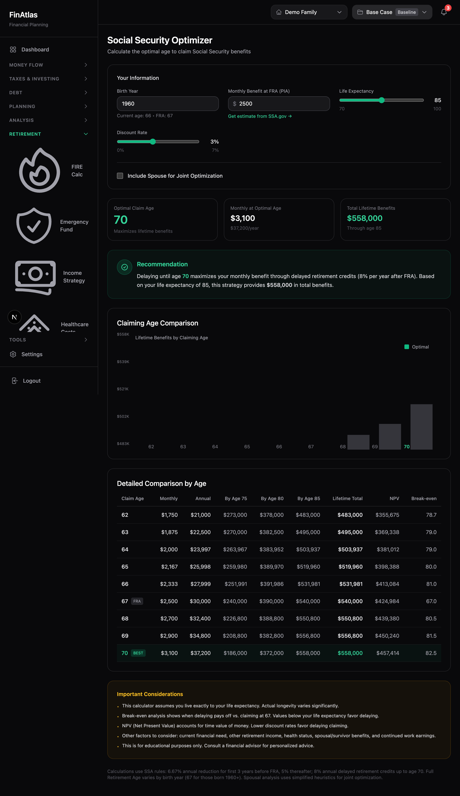
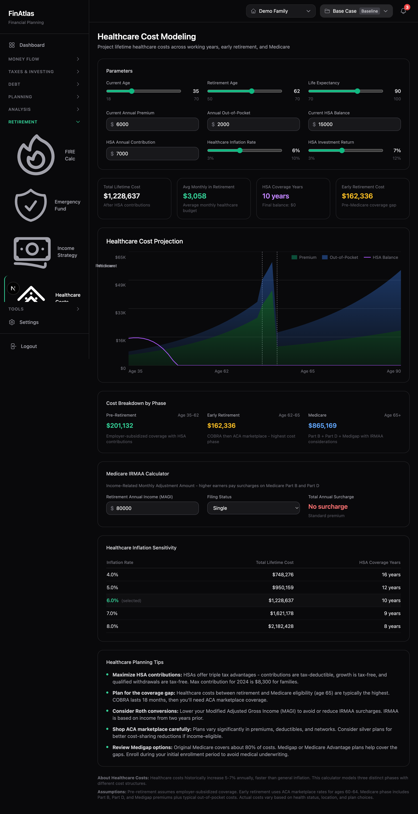
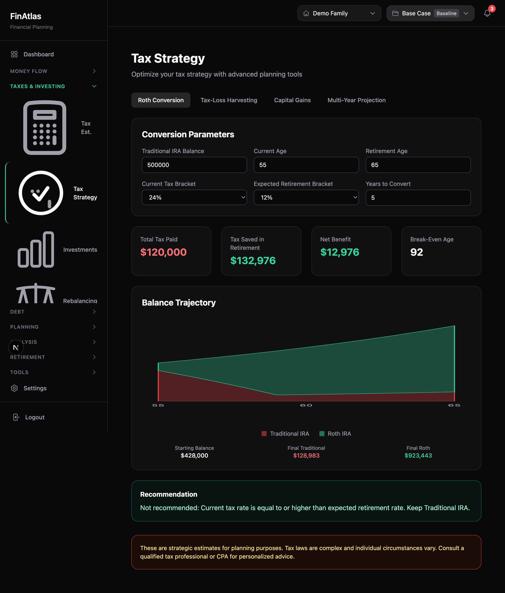
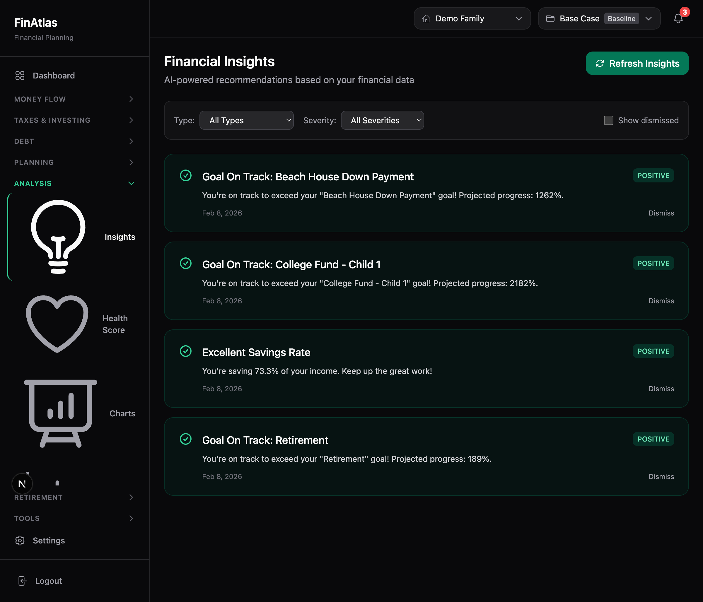
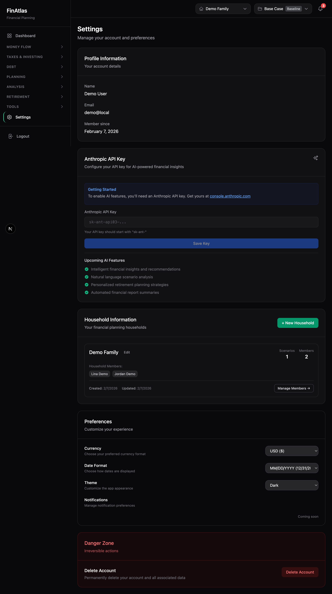

<p align="center">
  <h1 align="center">FinAtlas</h1>
  <p align="center">Comprehensive Personal Finance Management & Planning Platform</p>
</p>

<p align="center">
  
  
  
  
  
  
  
  
</p>

---

FinAtlas is a privacy-first, local-only household financial planning application that empowers individuals and families to take control of their financial future. With deterministic calculations, multi-scenario comparison, AI-powered streaming assistant with tool use, proactive financial insights, and specialized calculators for Social Security, healthcare costs, and tax optimization, FinAtlas provides institutional-grade financial planning tools in a clean, modern interface.


## Key Highlights

- **Privacy-First Architecture** — All data stored locally with SQLite. No financial data leaves your machine.
- **Deterministic Projections** — Every calculation is reproducible. No LLM approximations for your finances.
- **Multi-Scenario Planning** — Create baseline, optimistic, and pessimistic scenarios and compare them side-by-side.
- **AI-Powered Assistant** — Streaming chat with Anthropic Claude, function calling (tool use), and persistent conversation history.
- **Proactive Financial Insights** — Automated analysis engine generates personalized recommendations on savings, goals, and spending.
- **Financial Health Score** — Real-time composite health score with actionable improvement recommendations.
- **Social Security Optimizer** — Calculate optimal claiming age (62-70) with NPV analysis, spousal benefits, and break-even projections.
- **Healthcare Cost Modeling** — 3-phase lifetime cost projection (working, early retirement, Medicare) with IRMAA and HSA modeling.
- **Tax Strategy Engine** — Roth conversion analysis, tax-loss harvesting, capital gains optimization, and multi-year tax projections.
- **61 Feature Pages** — Comprehensive coverage from daily budgeting to long-term retirement planning.
- **64 API Routes** — Full REST API with rate limiting, input validation, scenario-scoped data, analytics, and AI integration.
- **Multi-Household Support** — Manage separate financial profiles for different households or family structures.
- **Dark / Light / System Theme** — Full theme toggle with automatic OS preference detection and zero-FOUC rendering.
- **PWA / Installable App** — Service worker with offline support, mobile-optimized bottom navigation, and home screen install.
- **214 Automated Tests** — 173 engine tests + 41 web tests with CI/CD pipeline via GitHub Actions.

---

## Screenshots

<table>
  <tr>
    <td align="center"><strong>Login</strong></td>
    <td align="center"><strong>Dashboard</strong></td>
  </tr>
  <tr>
    <td></td>
    <td></td>
  </tr>
  <tr>
    <td align="center"><strong>Income Management</strong></td>
    <td align="center"><strong>Investment Portfolio</strong></td>
  </tr>
  <tr>
    <td></td>
    <td></td>
  </tr>
  <tr>
    <td align="center"><strong>Financial Health Score</strong></td>
    <td align="center"><strong>Financial Charts</strong></td>
  </tr>
  <tr>
    <td></td>
    <td></td>
  </tr>
  <tr>
    <td align="center"><strong>Social Security Optimizer</strong></td>
    <td align="center"><strong>Healthcare Cost Modeling</strong></td>
  </tr>
  <tr>
    <td></td>
    <td></td>
  </tr>
  <tr>
    <td align="center"><strong>Tax Strategy Engine</strong></td>
    <td align="center"><strong>Financial Insights</strong></td>
  </tr>
  <tr>
    <td></td>
    <td></td>
  </tr>
  <tr>
    <td align="center"><strong>Debt Payoff Strategies</strong></td>
    <td align="center"><strong>FIRE Calculator</strong></td>
  </tr>
  <tr>
    <td></td>
    <td></td>
  </tr>
  <tr>
    <td align="center"><strong>AI Assistant</strong></td>
    <td align="center"><strong>Settings</strong></td>
  </tr>
  <tr>
    <td></td>
    <td></td>
  </tr>
</table>

---

## Feature Overview

### Money Flow
| Feature | Description |
|---------|-------------|
| **Income Tracking** | Track all income sources with flexible frequency options (monthly, biweekly, weekly, annual, one-time). Assign income to household members with growth projections. |
| **Expense Management** | Categorize and monitor expenses with customizable frequencies and inflation adjustments. Bulk operations for multi-select delete and category changes. |
| **Budget Tracking** | Set monthly budgets by category and monitor spending against defined targets with budget vs. actual comparisons. |
| **Spending Trends** | Analyze historical spending patterns over time with category-level breakdowns. |
| **Cash Flow Forecast** | Project monthly inflows, outflows, and running balance up to 24 months ahead. |
| **Recurring Transactions** | Manage recurring income and expense patterns with automatic scheduling. |

### Taxes & Investing
| Feature | Description |
|---------|-------------|
| **Tax Estimation** | Estimate federal and state tax liability with support for 2024 brackets, FICA, deductions, and filing status. |
| **Tax Strategy Engine** | Roth conversion analysis with break-even age, tax-loss harvesting opportunities, capital gains optimization, and multi-year tax projection across brackets. |
| **Investment Accounts** | Manage 401(k), IRA, Roth IRA, Brokerage, and HSA accounts with individual holdings and contributions. |
| **Real-Time Market Data** | Live stock quotes via Yahoo Finance integration with 15-minute cache. Portfolio summary with total value, gains, and allocation. |
| **Rebalancing** | Analyze portfolio allocation drift against targets and generate rebalancing recommendations. |
| **Investment Performance** | Track cost basis, gain/loss, and return percentages across all accounts with expandable holding detail views. |

### Debt Management
| Feature | Description |
|---------|-------------|
| **Loan Tracking** | Manage mortgages, auto loans, student loans, and personal debt with detailed terms and payment schedules. |
| **Amortization Schedules** | View month-by-month payment breakdowns showing principal vs. interest over the full loan term. |
| **Debt Payoff Strategies** | Compare snowball and avalanche payoff methods with projected timelines and total interest savings. |
| **Refinance Analysis** | Model refinancing scenarios to evaluate potential monthly savings and break-even points. |

### Planning
| Feature | Description |
|---------|-------------|
| **Financial Goals** | Set savings and investment goals with target amounts, dates, and priority levels. Track progress visually. |
| **Goal Funding Planner** | Plan and optimize funding strategies across multiple goals with priority-based allocation. |
| **Milestones** | Define life milestones (home purchase, retirement, education) with target dates and financial requirements. |
| **Financial Calendar** | View upcoming financial events, payment due dates, and goal deadlines in a calendar view. |
| **Household Members** | Manage household member profiles with role assignments and income allocation. |
| **College Savings** | Model 529 plan growth with contribution optimization, cost inflation projections, and state tax benefits. |
| **Insurance Calculator** | Analyze life and disability insurance coverage needs with gap analysis and recommendations. |

### Analysis & Insights
| Feature | Description |
|---------|-------------|
| **Proactive Financial Insights** | AI-powered insight engine analyzes spending spikes, savings rate, goal progress, debt milestones, net worth changes, budget adherence, and upcoming events. Dismissable cards on dashboard and dedicated insights page. |
| **Financial Health Score** | Composite health score (0-100) with category breakdowns, trend tracking, and actionable improvement tips. |
| **Multi-Year Charts** | Visualize net worth growth, income vs. expenses, asset allocation, and projections with interactive charts. |
| **Advanced Visualizations** | Cash flow Sankey diagrams, spending heatmaps, and asset allocation treemaps. |
| **Net Worth History** | Track net worth changes over time across all accounts and liabilities. |
| **Financial Ratios** | Monitor five key health indicators: debt-to-income, savings rate, liquidity ratio, housing ratio, and net-worth-to-income. |
| **Monte Carlo Simulations** | Run probability-based retirement projections accounting for market volatility and sequence-of-returns risk. |
| **Scenario Comparison** | Compare multiple financial scenarios side-by-side with detailed breakdowns. |
| **What-If Analysis** | Model hypothetical changes to income, expenses, or investments and see their projected impact. |

### Retirement & FIRE
| Feature | Description |
|---------|-------------|
| **FIRE Calculator** | Calculate your Financial Independence, Retire Early target with adjustable withdrawal rates, expected returns, and inflation assumptions. |
| **Social Security Optimizer** | Calculate optimal claiming age (62-70) with early reduction/delayed credits, spousal benefits, NPV analysis at custom discount rates, break-even age calculator, and lifetime benefit comparison chart. |
| **Healthcare Cost Modeling** | 3-phase lifetime healthcare cost projection (working years, early retirement gap, Medicare). Includes HSA growth modeling, IRMAA surcharge calculator, healthcare inflation sensitivity analysis, and cost breakdown by phase. |
| **Retirement Income** | Social Security optimization (claim at 62/67/70), withdrawal order planning, and year-by-year income projections. |
| **Emergency Fund Tracker** | Monitor emergency fund adequacy relative to monthly expenses with target month coverage. |

### Tools & Export
| Feature | Description |
|---------|-------------|
| **Reports** | Generate comprehensive PDF financial reports across all data categories. |
| **Data Export** | Download income, expenses, loans, accounts, and goals as CSV files for external analysis. |
| **CSV Import** | Bulk import financial data from spreadsheets with guided column mapping and downloadable templates. |
| **Transaction Categorization** | Auto-categorize expenses with customizable rules, pattern matching, and bulk apply. |
| **AI Assistant** | Streaming chat with Anthropic Claude, function calling (tool use) for querying financial data directly, persistent conversation history with sidebar, and contextual prompt recommendations. |
| **Smart Notifications** | Computed financial alerts for budget overspend, upcoming bills, goal milestones, and risk indicators. |
| **Global Search** | Search across all entities (incomes, expenses, accounts, loans, goals) with Cmd+K. |

### Personalization
| Feature | Description |
|---------|-------------|
| **Dashboard Customization** | Toggle dashboard widgets on/off and reorder them to your preference. |
| **Theme Toggle** | Switch between Dark, Light, and System themes. CSS variable-based zinc palette inversion adapts the entire UI. |
| **Currency & Date Format** | Choose preferred currency (USD, EUR, GBP, JPY) and date display format. |
| **PWA / Installable App** | Install FinAtlas as a standalone app on desktop and mobile. Service worker provides offline fallback, asset caching, and mobile-optimized bottom navigation. |
| **Preferences Persistence** | All user preferences stored in localStorage with instant application across sessions. |

---

## Tech Stack

| Layer | Technology |
|-------|-----------|
| **Framework** | [Next.js 16](https://nextjs.org/) (App Router, Turbopack) |
| **Language** | [TypeScript](https://www.typescriptlang.org/) 5.9 (strict mode) |
| **UI** | [React](https://react.dev/) 19 |
| **Styling** | [Tailwind CSS](https://tailwindcss.com/) 3.4 with CSS variable theming |
| **Database** | SQLite via [Prisma](https://www.prisma.io/) 6.2 ORM |
| **Authentication** | JWT with httpOnly cookies, [Argon2](https://github.com/ranisalt/node-argon2) password hashing |
| **AI Integration** | [Anthropic Claude](https://www.anthropic.com/) API with SSE streaming and tool use |
| **Validation** | [Zod](https://zod.dev/) schemas + custom input sanitization |
| **Charts** | Custom SVG charts + [Ant Design Charts](https://charts.ant.design/) |
| **PDF Reports** | [@react-pdf/renderer](https://react-pdf.org/) |
| **Build System** | [Turborepo](https://turbo.build/) + pnpm workspaces |
| **Testing** | [Vitest](https://vitest.dev/) (214 tests: 173 engine + 41 web) |
| **CI/CD** | [GitHub Actions](https://github.com/features/actions) (typecheck, test, build) |
| **Engine** | Custom deterministic financial projection engine (`@finatlas/engine`) |

---

## Project Structure

```
finatlas/
├── .github/
│   └── workflows/              # CI/CD pipelines
│       ├── ci.yml              # Main CI: typecheck, test, build
│       └── pr-check.yml        # PR validation: typecheck + test
├── apps/
│   └── web/                    # Next.js 16 web application
│       ├── app/
│       │   ├── (app)/          # Authenticated routes (61 pages)
│       │   │   ├── social-security/   # SS claiming optimizer
│       │   │   ├── healthcare/        # Healthcare cost modeling
│       │   │   ├── tax-strategy/      # Tax optimization engine
│       │   │   ├── insights/          # Proactive insights page
│       │   │   └── ...               # 50+ other feature pages
│       │   ├── api/            # REST API endpoints (64 routes)
│       │   │   ├── ai/chat/           # Streaming AI with tool use
│       │   │   ├── conversations/     # Conversation persistence
│       │   │   ├── insights/          # Insight generation & CRUD
│       │   │   ├── market/            # Live market data
│       │   │   └── ...               # 55+ other API routes
│       │   └── offline/        # PWA offline fallback page
│       ├── components/
│       │   ├── assistant/      # Chat panel, conversation list
│       │   ├── bulk/           # Bulk action components
│       │   ├── charts/         # SVG chart components (Sankey, Heatmap, Treemap)
│       │   ├── college/        # College savings charts
│       │   ├── dashboard/      # Dashboard client & configuration
│       │   ├── healthcare/     # Healthcare cost chart & summary
│       │   ├── import/         # CSV import wizard
│       │   ├── insights/       # Insights widget & cards
│       │   ├── insurance/      # Insurance coverage charts
│       │   ├── investments/    # Portfolio summary, holdings table
│       │   ├── layout/         # Sidebar, AppShell, MobileNav
│       │   ├── notifications/  # Smart notification bell & panel
│       │   ├── retirement/     # Retirement income charts & tables
│       │   ├── settings/       # Settings page components
│       │   ├── social-security/ # SS comparison chart & results
│       │   ├── tax/            # Roth conversion, tax-loss, capital gains charts
│       │   └── ui/             # Reusable UI primitives
│       ├── contexts/           # React context providers (Chat, Theme, Scenario)
│       ├── lib/
│       │   ├── ai/             # AI tools, tool handlers, prompts
│       │   ├── amortization/   # Loan amortization calculations
│       │   ├── assistant/      # AI prompt recommendation engine
│       │   ├── auth/           # Session management
│       │   ├── categorization/ # Expense categorization rules
│       │   ├── college/        # College savings calculations
│       │   ├── dashboard/      # Dashboard widget configuration
│       │   ├── db/             # Prisma client
│       │   ├── debt/           # Debt payoff strategies
│       │   ├── health/         # Financial health score calculations
│       │   ├── healthcare/     # Healthcare cost & IRMAA calculations
│       │   ├── insights/       # Proactive insight engine (7 analyzers)
│       │   ├── insurance/      # Insurance needs calculations
│       │   ├── market/         # Yahoo Finance market data service
│       │   ├── performance/    # Investment performance calculations
│       │   ├── ratios/         # Financial ratio calculations
│       │   ├── refinance/      # Refinance analysis calculations
│       │   ├── retirement/     # Retirement income calculations
│       │   ├── social-security/ # SS claiming optimization engine
│       │   ├── tax/            # Tax optimization (Roth, TLH, CG)
│       │   ├── visualizations/ # Chart layout algorithms
│       │   ├── format.ts       # Currency, date, percent formatters
│       │   ├── rateLimit.ts    # In-memory sliding window rate limiter
│       │   └── validation.ts   # Input sanitization & validation
│       ├── public/
│       │   ├── manifest.json   # PWA manifest
│       │   └── sw.js           # Service worker
│       └── prisma/             # Database schema and migrations
├── packages/
│   ├── engine/                 # Deterministic financial projection engine
│   │   ├── __tests__/          # 173 engine tests (8 test suites)
│   │   ├── src/
│   │   │   ├── internal/       # Core calculation modules
│   │   │   ├── types.ts        # TypeScript definitions
│   │   │   └── contract.ts     # Engine API contract
│   │   └── vitest.config.ts    # Engine test configuration
│   └── schemas/                # Shared Zod validation schemas
└── docker-compose.yml          # Docker deployment configuration
```

---

## Getting Started

### Prerequisites

- Node.js 20+
- pnpm 9.0+

### Installation

```bash
# Clone the repository
git clone <repository-url>
cd finatlas

# Install dependencies
pnpm install

# Set up environment variables
cp .env.example apps/web/.env
```

Configure `apps/web/.env`:

```env
# Authentication
AUTH_JWT_SECRET=your-secret-key-min-32-chars
AUTH_COOKIE_NAME=finatlas_session

# Database
DATABASE_URL="file:./prisma/dev.db"

# AI Assistant (optional)
ANTHROPIC_API_KEY=your-anthropic-api-key
```

```bash
# Initialize the database
pnpm db:migrate
pnpm db:seed

# Start the development server
pnpm dev
```

Open [http://localhost:3000](http://localhost:3000) in your browser.

### Default Credentials

- **Email:** `demo@local`
- **Password:** `Demo1234!`

---

## Architecture

### Financial Engine

The core projection engine (`@finatlas/engine`) is fully deterministic and decoupled from the frontend:

```typescript
import { runEngine } from "@finatlas/engine";

const result = runEngine({
  scenarioId: "baseline",
  household: { ... },
  assumptions: { ... },
  incomes: [...],
  expenses: [...],
  accounts: [...],
  loans: [...],
  goals: [...],
});

// Access projection results
result.series.netWorth;    // Monthly net worth series
result.series.income;      // Monthly income series
result.warnings;           // Validation warnings
```

**Engine Modules:**
- `projection.ts` — Month-by-month simulation loop
- `taxes.ts` — Federal + state tax calculations (2024 brackets)
- `accounts.ts` — Investment account balance tracking with contributions
- `loans.ts` — Loan amortization and payoff scheduling
- `schedules.ts` — Income/expense frequency normalization
- `growth.ts` — Inflation and growth rate adjustments

**Engine Test Coverage:** 173 tests across 8 suites covering contract validation, math utilities, date handling, growth calculations, loan amortization, tax brackets, schedule normalization, and Monte Carlo simulations.

### AI Assistant

The AI assistant uses Anthropic Claude with:

- **SSE Streaming** — Real-time response streaming via Server-Sent Events for responsive UI
- **Tool Use (Function Calling)** — 6 tools for querying financial data: `query_financial_summary`, `query_accounts`, `query_incomes`, `query_expenses`, `query_loans`, `modify_scenario`
- **Conversation Persistence** — Full conversation history stored in database with title, preview, and delete support
- **Contextual Prompts** — Smart prompt suggestions adapt to your financial data (mentions specific incomes, expenses, loans by name)
- **Multi-Turn Tool Loops** — Up to 5 tool use iterations per message for complex queries

### Proactive Insights Engine

Automated analysis runs 7 analyzers against your financial data:

- **Spending Trends** — Detects month-over-month spending spikes
- **Savings Rate** — Monitors savings rate against healthy benchmarks
- **Goal Progress** — Tracks progress toward financial goals with projected completion
- **Debt Milestones** — Alerts on loan payoff progress and upcoming milestones
- **Net Worth Changes** — Monitors significant net worth movements
- **Budget Adherence** — Warns when spending exceeds category budgets
- **Upcoming Events** — Surfaces upcoming life events and financial deadlines

### Navigation

The sidebar organizes 61 pages into 9 collapsible sections:

- **Money Flow** — Income, Expenses, Budget, Trends, Cash Flow, Recurring
- **Taxes & Investing** — Tax Estimation, Tax Strategy, Investments, Rebalancing, Performance
- **Debt** — Loans, Amortization, Debt Payoff, Refinance
- **Planning** — Goals, Goal Planner, Milestones, Calendar, Members, College Savings, Insurance Calc
- **Analysis** — Insights, Financial Health, Charts, Visualizations, Net Worth History, Ratios, Monte Carlo, Compare, What-If
- **Retirement** — FIRE Calculator, Emergency Fund, Income Strategies, Healthcare Costs, Social Security
- **Tools** — Reports, Export, Import Data, Categorize, Assistant
- **Settings** — Preferences (Theme, Currency, Date Format)

### API

64 REST API endpoints with rate limiting and input validation:

| Category | Endpoints | Description |
|----------|-----------|-------------|
| Auth | `/api/auth/*` | Login, logout, session management |
| Data CRUD | `/api/incomes`, `/api/expenses`, `/api/loans`, `/api/accounts`, `/api/goals` | Full CRUD with scenario scoping |
| Bulk Operations | `/api/*/bulk-delete`, `/api/expenses/bulk-update` | Multi-record operations |
| Projections | `/api/projections` | Run financial engine |
| Analysis | `/api/dashboard`, `/api/cash-flow`, `/api/net-worth-history`, `/api/health-score` | Aggregated analytics |
| Insights | `/api/insights`, `/api/insights/generate` | Proactive insight generation and management |
| Conversations | `/api/conversations`, `/api/conversations/[id]`, `/api/conversations/[id]/messages` | AI conversation persistence |
| Market Data | `/api/market/quotes` | Live stock price quotes via Yahoo Finance |
| Visualizations | `/api/visualizations` | Sankey, heatmap, treemap data |
| Notifications | `/api/notifications` | Computed financial alerts |
| Search | `/api/search` | Cross-entity global search |
| AI | `/api/ai/chat`, `/api/ai/recommendations` | Streaming AI assistant with tool use |
| Export/Import | `/api/export`, `/api/import/*` | CSV data exchange |

### Security

- **Rate Limiting** — In-memory sliding window rate limiter on all API routes (configurable per-endpoint)
- **Input Validation** — Sanitized strings, validated IDs (CUID format), bounded pagination, and number range checks
- **Security Headers** — CSP, X-Content-Type-Options, X-Frame-Options, X-XSS-Protection, Referrer-Policy via `next.config.mjs`
- **Authentication** — JWT with httpOnly secure cookies, Argon2 password hashing
- **Scenario Scoping** — All data queries automatically scoped to the user's household and selected scenario

---

## CI/CD

GitHub Actions workflows for automated quality checks:

- **`ci.yml`** — Runs on push to `main`: pnpm install, Prisma generate, typecheck (engine + web), test (engine + web), production build
- **`pr-check.yml`** — Runs on pull requests: typecheck + test (lighter, faster feedback)
- **Environment:** Node 22, pnpm 9, SQLite for CI, concurrency groups to cancel stale runs

---

## Docker Deployment

```bash
# Using Docker Compose
docker-compose up --build

# Manual build
docker build -t finatlas .
docker run -d -p 3000:3000 \
  -e AUTH_JWT_SECRET=your-secret \
  -e DATABASE_URL=file:/app/data/finatlas.db \
  -v finatlas-data:/app/data \
  finatlas
```

---

## Development

| Command | Description |
|---------|-------------|
| `pnpm dev` | Start development server (Turbopack) |
| `pnpm build` | Production build (all packages) |
| `pnpm typecheck` | TypeScript type checking |
| `pnpm lint` | ESLint |
| `pnpm test` | Run test suite (214 tests) |
| `pnpm db:migrate` | Run Prisma migrations |
| `pnpm db:seed` | Seed database with demo data |
| `pnpm db:studio` | Open Prisma Studio GUI |

---

## Contributing

Contributed by **Sharanya Mattaparthy**.

---

## License

Copyright &copy; 2025 **Spaarna LLC**. All rights reserved.

This software is proprietary and confidential. Unauthorized copying, distribution, or modification of this project, via any medium, is strictly prohibited without prior written permission from Spaarna LLC.
